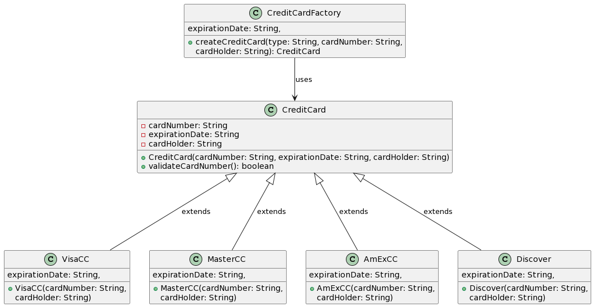
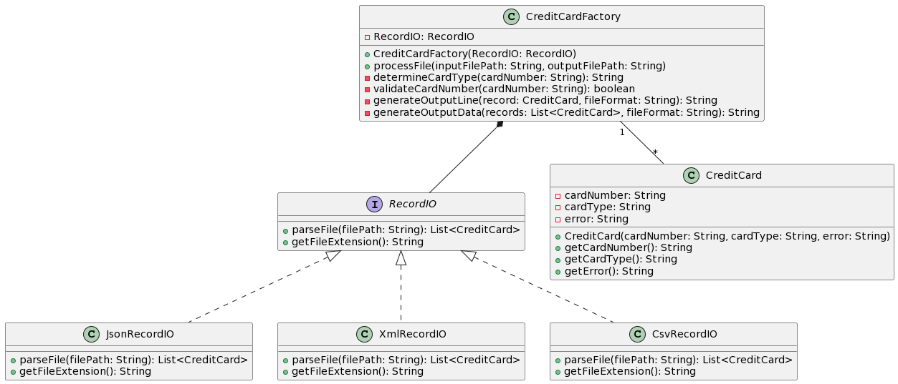
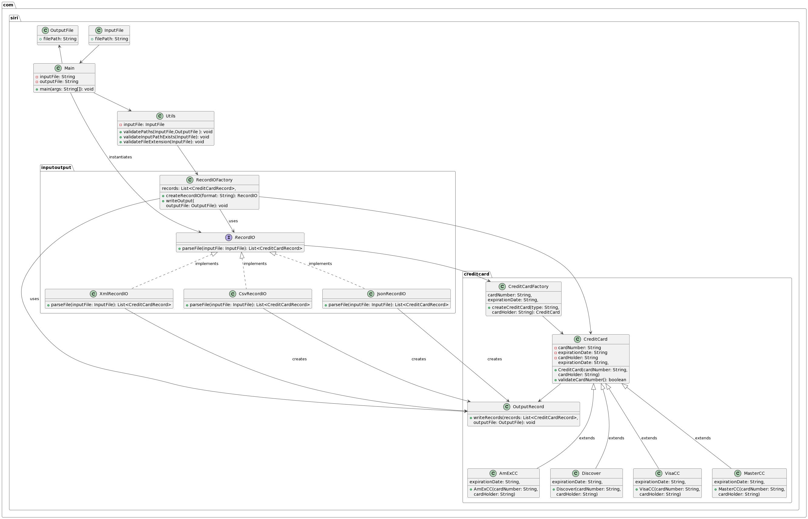

# Individual-project-sirisha
Course Name :Software Systems Engineering</br> 
Project Name:Credit card problem</br>
Student Name:[Sirisha Polisetty](https://www.linkedin.com/in/sirishapolisetty/)<br/>
University Name:[San Jose State University](https://www.sjsu.edu/)<br/>
Professor's Name:[gopinath V](https://www.linkedin.com/in/gopinath-v-75286719/)</br> 


## Part 1

The primary problem to solve is reading credit card records from a file, verifying the validity of the credit card numbers, and creating instances of the appropriate credit card classes based on the card type.

The secondary problems are:

- Identifying the card type based on the credit card number.
- Creating the appropriate credit card class dynamically.
- To solve these problems, we can use the following design patterns:

Factory Method Pattern: We can create a CreditCardFactory class that encapsulates the logic for creating instances of the appropriate credit card classes based on the card type. The factory method will take the card type as input and return an instance of the corresponding credit card class. This pattern allows for the decoupling of object creation from the client code and provides a consistent interface for creating credit card objects.

Strategy Pattern: We can use the Strategy pattern to encapsulate the validation algorithm for each card type. Each credit card class can implement its own validation strategy, allowing for flexibility and easy switching between different validation algorithms. This pattern promotes code reusability and maintainability.

By utilizing the Factory Method pattern, the CreditCardFactory class can dynamically create instances of the appropriate credit card classes based on the card type identified. This pattern abstracts the creation logic and allows for easy extensibility by adding new subclasses for different credit card types.

The Strategy pattern allows each credit card class to define its own validation strategy, encapsulating the validation algorithm within the respective classes. This makes it easy to add new credit card types in the future and simplifies the switching of validation strategies for different card types.

The consequences of using these design patterns are:

- Improved code maintainability: The Factory Method pattern decouples the client code from the specific credit card class implementations, allowing for easier modifications and extensions. It promotes the Open-Closed Principle, enabling the addition of new credit card types without modifying existing code.
- Code reusability: The Strategy pattern encapsulates the validation logic within each credit card class, promoting code reuse and ensuring that the validation algorithm can be easily switched or extended for new requirements.
- Modularity and extensibility: The use of design patterns provides a modular and extensible solution by separating concerns and providing clear interfaces for object creation and validation.

Overall, these design patterns enable a flexible and maintainable solution to handle credit card records, identify card types, and create appropriate credit card objects.


## Part 2 

To extend the design to parse different input file formats (json, xml, csv) and detect the type of credit card, we can use the following approach:
File Identification Classes: Create separate classes for each file format (e.g., JSONRecordIO, XMLRecordIO, CSVRecordIO) responsible for parsing the input files and extracting credit card records.
Credit Card Factory: Implement a CreditCardFactory class that takes the parsed credit card records and identifies the type of credit card based on the card number using the same validation logic from Part 1.
Output Record Classes: Output Record classes for each file format (e.g., JSONRecordIO, XMLRecordIO, CSVRecordIO) responsible for generating the output files with the detected card type and any validation errors.

Extension of the Part 1 for RecordIO and Credit Card Factory.


The CreditCard Factory class checks a list of CreditCardFatory objects from the file parser and uses the same validation process as in Part 1 to determine the card type for each record. It then creates a list of CreditCardInfo objects that includes the card number, card type (if valid), and any errors (if invalid).

The OutputRecords classes use the list of CreditCardInfo objects to create an output file in the corresponding format (json, xml, csv) that includes the card number, card type, and error information (if applicable).

Our design enables seamless integration of new file formats and their corresponding RecordIO and output record in the future. Each file format has its own parser and output generator class, making the system more modular and easily extensible. Moreover, the RecordIOFactory class can use the validation logic from Part 1 to identify the card type of different file formats.

## Complete Design



The UML class diagram depicts the structure of the design for the implementation of the credit card parser problem. Here is an explanation of the classes and their relationships:

- Main: This class represents the main entry point of the application. It has the responsibility to handle command-line arguments, such as input and output file paths, and execute the necessary logic.
- Utils: This class contains utility methods that validate the input and output file paths. It ensures that the paths exist and have the correct file extensions.
- InputFile and OutputFile: These classes represent the input and output file paths, respectively.
- RecordIOFactory: This class is responsible for creating the appropriate RecordIO object based on the file format specified. It utilizes the Factory Method pattern to create the desired object.
- RecordIO: This interface defines the contract for parsing files of different formats and returning a list of CreditCardRecord objects.
- XmlRecordIO, CsvRecordIO, JsonRecordIO: These classes implement the RecordIO interface and provide specific implementations for parsing XML, CSV, and JSON files, respectively.
- CreditCard: This class represents a generic credit card and contains common properties like cardNumber, expirationDate, and cardHolder. It also has a method validateCardNumber() that verifies the validity of the card number.
- VisaCC, MasterCC, AmExCC, Discover: These classes are subclasses of CreditCard and represent specific types of credit cards. They inherit the properties and methods from the base class and may provide additional functionality specific to their card type.
- OutputRecord: This class is responsible for writing a list of CreditCardRecord objects to the output file.
CreditCardFactory: This class implements the Factory Method pattern and is responsible for creating instances of the appropriate credit card subclasses based on the card type specified.

The diagram also shows the relationships between the classes, such as associations, generalizations, and dependencies.
The design is intended to be flexible and easy to expand using design patterns such as Factory Method, inheritance, and interface implementations. It divides tasks, such as handling input/output, validating credit cards, and creating objects, into separate classes, which helps ensure the code is modular and easy to maintain.


## Java Version

Ensure you have Java version 1.8.0_333 installed and configured; you can check this by running java -version in your terminal before proceeding with the project setup.

```
siris-MacBook-Pro:indivi-202 siri$ java -version
java version "1.8.0_333"
Java(TM) SE Runtime Environment (build 1.8.0_333-b02)
Java HotSpot(TM) 64-Bit Server VM (build 25.333-b02, mixed mode)
```

## To build the project, execute the command mvn clean install in your terminal, which will clean the target directory, compile the source code, and generate the output artifacts

```
siris-MacBook-Pro:indivi-202 siri$ mvn clean install
```

[Build Log File](buildlogfile.log)

For usage, run the command java -jar target/individual-project-siri.jar [input_file_path] [output_file_path] with the desired CSV input file and the intended output file path

## CSV
```
siris-MacBook-Pro:indivi-202 siri$ java -jar target/individual-project-siri.jar src/main/resources/input_file-1.csv src/main/resources/output_file-1.csv
Output successfully written to src/main/resources/output_file-1.csv
```
```
siris-MacBook-Pro:indivi-202 siri$ cat src/main/resources/output_file-1.csv 
cardNumber,cardType
5567894523129089,MasterCard
59012345678901234567890,Invalid: more than 19 digits
4123456789123,Visa
347856341908126,AmericanExpress
6011111100007756,Discover
3601112345678789,Invalid: not a possible card number
5167894523129089,MasterCard
4123456789123999,Visa
377856341908126,AmericanExpress
5367894523129089,MasterCard
6011*890HJrt6789,Invalid: non numeric characters
,Invalid: empty/null card number
```
## JSON
For usage, run the command java -jar target/individual-project-siri.jar [input_file_path] [output_file_path] with the desired json input file and the intended output file path
```
siris-MacBook-Pro:indivi-202 siri$ java -jar target/individual-project-siri.jar src/main/resources/input_file-1.json src/main/resources/output_file-1.json
Output successfully written to src/main/resources/output_file-1.json
```

```
siris-MacBook-Pro:indivi-202 siri$ cat src/main/resources/output_file-1.json
{
  "cards" : [ {
    "cardNumber" : "5567894523129089",
    "CardType" : "MasterCard"
  }, {
    "cardNumber" : "59012345678901234567890",
    "CardType" : "Invalid: more than 19 digits"
  }, {
    "cardNumber" : "4123456789123",
    "CardType" : "Visa"
  }, {
    "cardNumber" : "347856341908126",
    "CardType" : "AmericanExpress"
  }, {
    "cardNumber" : "6011111100007756",
    "CardType" : "Discover"
  }, {
    "cardNumber" : "3601112345678789",
    "CardType" : "Invalid: not a possible card number"
  }, {
    "cardNumber" : "5167894523129089",
    "CardType" : "MasterCard"
  }, {
    "cardNumber" : "4123456789123999",
    "CardType" : "Visa"
  }, {
    "cardNumber" : "377856341908126",
    "CardType" : "AmericanExpress"
  }, {
    "cardNumber" : "5367894523129089",
    "CardType" : "MasterCard"
  }, {
    "cardNumber" : "6011*890HJrt6789",
    "CardType" : "Invalid: non numeric characters"
  }, {
    "cardNumber" : null,
    "CardType" : "Invalid: empty/null card number"
  } ]
}
```
## XML
For usage, run the command java -jar target/individual-project-siri.jar [input_file_path] [output_file_path] with the desired xml input file and the intended output file path
```
siris-MacBook-Pro:indivi-202 siri$ java -jar target/individual-project-siri.jar src/main/resources/input_file.xml src/main/resources/output_file-1.xml
Output successfully written to src/main/resources/output_file-1.xml
```
```
siris-MacBook-Pro:indivi-202 siri$ cat src/main/resources/output_file-1.xml
<CARDS>
  <CARD>
    <CARD_NUMBER>5567894523129089</CARD_NUMBER>
    <CARD_TYPE>MasterCard</CARD_TYPE>
  </CARD>
  <CARD>
    <CARD_NUMBER>59012345678901234567890</CARD_NUMBER>
    <CARD_TYPE>Invalid: more than 19 digits</CARD_TYPE>
  </CARD>
  <CARD>
    <CARD_NUMBER>4123456789123</CARD_NUMBER>
    <CARD_TYPE>Visa</CARD_TYPE>
  </CARD>
  <CARD>
    <CARD_NUMBER>347856341908126</CARD_NUMBER>
    <CARD_TYPE>AmericanExpress</CARD_TYPE>
  </CARD>
  <CARD>
    <CARD_NUMBER>6011111100007756</CARD_NUMBER>
    <CARD_TYPE>Discover</CARD_TYPE>
  </CARD>
  <CARD>
    <CARD_NUMBER>3601112345678789</CARD_NUMBER>
    <CARD_TYPE>Invalid: not a possible card number</CARD_TYPE>
  </CARD>
  <CARD>
    <CARD_NUMBER>5167894523129089</CARD_NUMBER>
    <CARD_TYPE>MasterCard</CARD_TYPE>
  </CARD>
  <CARD>
    <CARD_NUMBER>4123456789123999</CARD_NUMBER>
    <CARD_TYPE>Visa</CARD_TYPE>
  </CARD>
  <CARD>
    <CARD_NUMBER>377856341908126</CARD_NUMBER>
    <CARD_TYPE>AmericanExpress</CARD_TYPE>
  </CARD>
  <CARD>
    <CARD_NUMBER>5367894523129089</CARD_NUMBER>
    <CARD_TYPE>MasterCard</CARD_TYPE>
  </CARD>
  <CARD>
    <CARD_NUMBER>6011*890HJrt6789</CARD_NUMBER>
    <CARD_TYPE>Invalid: non numeric characters</CARD_TYPE>
  </CARD>
  <CARD>
    <CARD_NUMBER></CARD_NUMBER>
    <CARD_TYPE>Invalid: empty/null card number</CARD_TYPE>
  </CARD>
</CARDS>
```
## Validations
Ensure that the required number of arguments are passed during execution, as the program performs validations to check for the correct input and output file paths
```
siris-MacBook-Pro:indivi-202 siri$ java -jar target/individual-project-siri.jar 
Invalid syntax. Usage: java Main <input filename> <output filename>
```
